# Lattice v2.2 — Database Schema Review

Single source of truth is `prisma/schema.prisma`. **Keep this file in sync with every schema
change** (mermaid ERD + per-table examples). 25 tables, ordered by dependency tier 0 → 6.

| Tier | Theme | Tables |
|------|-------|--------|
| 0 | External catalog | `google_action_types`, `google_device_traits` |
| 1 | Device & ML catalog | `devices`, `device_capabilities`, `device_capability_traits`, `device_capability_pins`, `ml_models` |
| 2 | Identity | `users`, `mqtt_user`, `user_login_audit` |
| 3 | User devices & actions | `user_devices`, `user_action_groups`, `user_device_actions`, `user_device_action_pins` |
| 4 | Automation (rules; emergencies = rules with `is_emergency`) | `user_rules`, `user_rule_conditions`, `user_rule_actions`, `user_rule_events` |
| 5 | Pipelines (ML execution) | `pipelines`, `pipeline_sensors`, `pipeline_stages`, `pipeline_triggers`, `pipeline_runs`, `pipeline_run_stages` |
| 6 | Telemetry | `sensor_history` |

---

## ER Diagram

```mermaid
erDiagram
  %% ── Tier 0: external catalog ──
  GoogleActionType {
    int id PK
    string value UK "action.devices.types.*"
  }
  GoogleDeviceTrait {
    int id PK
    string value UK "action.devices.traits.*"
    json valid_parameters "external Google contract"
  }

  %% ── Tier 1: device & ML catalog ──
  Device {
    int id PK
    string type
    string version
    string default_name UK
  }
  DeviceCapability {
    int id PK
    int device_id FK
    string capability_key "stable per-device key"
    string label
    string implementation_type
    string mqtt_action_type
    string mqtt_action_name
    int min_telemetry_interval_ms
    int google_type_id FK "nullable"
  }
  DeviceCapabilityTrait {
    int id PK
    int capability_id FK
    int google_trait_id FK
  }
  DeviceCapabilityPin {
    int id PK
    int capability_id FK
    string key
    string label
    string mode "INPUT/OUTPUT"
  }
  MlModel {
    int id PK
    string kind "vlm/llm"
    string name
    string version
    string backend "onnx/ollama"
    json classes "model metadata"
    json config "model metadata"
  }

  %% ── Tier 2: identity ──
  User {
    int id PK
    string email UK
    string user_role
    string google_id UK "nullable"
  }
  MqttUser {
    int id PK
    string username UK
    string password_hash
    bool is_superuser
  }
  UserLoginAudit {
    int id PK
    int user_id FK
    datetime login_at
    string ip_address
  }

  %% ── Tier 3: user devices & actions ──
  UserDevice {
    int id PK
    int device_type_id FK "current Device"
    int user_id FK
    string mac_id UK
    string name
    bool online
    int pending_device_type_id FK "nullable"
  }
  UserActionGroup {
    int id PK
    int user_id FK
    string name
    int sort_order "dashboard card position"
  }
  UserDeviceAction {
    int id PK
    int user_device_id FK
    int capability_id FK
    int group_id FK "nullable"
    string action_name
    string mqtt_action_name
    string current_state
    string status "active/staged_*/deprecated"
    int sort_order "position within group"
    int telemetry_interval_ms
    string camera_resolution "nullable; CameraAction only, e.g. VGA/SVGA/XGA"
    string camera_transport "nullable; CameraAction only, ws/http, default http"
  }
  UserDeviceActionPin {
    int id PK
    int user_device_action_id FK
    int capability_pin_id FK "→ device_capability_pins.id"
    int pin_number "assigned GPIO"
  }

  %% ── Tier 4: automation (rules) ──
  UserRule {
    int id PK
    int user_id FK
    string name
    bool enabled
    bool is_emergency "fast-path safety rule"
    string condition_operator "AND/OR"
    int cooldown_seconds
  }
  UserRuleCondition {
    int id PK
    int rule_id FK
    string condition_type "threshold/device_status/schedule/vlm"
    int user_device_action_id FK "threshold, nullable"
    string operator "threshold"
    string threshold_value "threshold"
    int user_device_id FK "device_status, nullable"
    string status_value "online/offline"
    string schedule_time "HH:MM"
    int_array schedule_days "0=Sun..6=Sat"
  }
  UserRuleAction {
    int id PK
    int rule_id FK
    int user_device_action_id FK
    string target_state
    int delay_seconds
  }
  UserRuleEvent {
    int id PK
    int rule_id FK
    string triggered_value
    datetime fired_at
  }

  %% ── Tier 5: pipelines ──
  Pipeline {
    int id PK
    int user_id FK
    string name
    bool enabled
  }
  PipelineSensor {
    int id PK
    int pipeline_id FK
    int user_device_action_id FK
    string group_name
    string description "required LLM context note"
    bool inject_as_sensor "default true; include in historic digest + current state"
    bool inject_as_action "default false; include in LLM available_actions"
    string min_value
    string max_value
    string compression "average/last_n/min_max/min_max_avg/time_series"
    int window_minutes "default 60"
    int n "nullable; required for last_n"
  }
  PipelineStage {
    int id PK
    int pipeline_id FK
    int ordinal
    string kind "enrich/infer/command_exec"
    int ml_model_id FK "nullable"
    json config "optional per-stage overrides"
  }
  PipelineTrigger {
    int id PK
    int pipeline_id FK
    string trigger_type "telemetry/schedule/manual"
    int user_device_action_id FK "nullable"
    string operator
    string threshold_value
    string schedule_cron
    int min_interval_sec
  }
  PipelineRun {
    int id PK
    int pipeline_id FK
    string status "queued/running/completed/failed"
    string trigger_type "manual/sensor_threshold/schedule"
    json trigger_payload "ML audit blob"
    bool is_dry_run "default false"
    json sensor_overrides "nullable; dry-run override map"
    datetime started_at
    datetime completed_at
  }
  PipelineRunStage {
    int id PK
    int run_id FK
    int stage_id FK
    string status
    json input "ML audit blob"
    json output "ML audit blob"
  }

  %% ── Tier 6: telemetry ──
  SensorHistory {
    int id PK
    int user_device_action_id FK
    string value "scalar or base64 image"
    datetime recorded_at
  }

  %% ── Relationships ──
  Device                ||--o{ DeviceCapability       : "declares"
  GoogleActionType      |o--o{ DeviceCapability       : "google type"
  DeviceCapability      ||--o{ DeviceCapabilityTrait  : "has"
  GoogleDeviceTrait     ||--o{ DeviceCapabilityTrait  : "google trait"
  DeviceCapability      ||--o{ DeviceCapabilityPin    : "pin slots"
  DeviceCapability      ||--o{ UserDeviceAction       : "instantiated as"

  Device                ||--o{ UserDevice             : "current model"
  Device                |o--o{ UserDevice             : "pending model"
  User                  ||--o{ UserDevice             : "owns"
  User                  ||--o{ UserActionGroup        : "owns"
  User                  ||--o{ UserRule               : "owns"
  User                  ||--o{ Pipeline               : "owns"
  User                  ||--o{ UserLoginAudit         : "logins"

  UserDevice            ||--o{ UserDeviceAction       : "has"
  UserDevice            |o--o{ UserRuleCondition      : "status checked by"
  UserActionGroup       |o--o{ UserDeviceAction       : "groups"
  UserDeviceAction      ||--o{ UserDeviceActionPin    : "pin assignment"

  UserRule              ||--o{ UserRuleCondition      : "when"
  UserRule              ||--o{ UserRuleAction         : "then"
  UserRule              ||--o{ UserRuleEvent          : "fired"
  UserDeviceAction      |o--o{ UserRuleCondition      : "reads"
  UserDeviceAction      ||--o{ UserRuleAction         : "commands"

  MlModel               |o--o{ PipelineStage          : "runs"
  Pipeline              ||--o{ PipelineSensor         : "inputs"
  Pipeline              ||--o{ PipelineStage          : "steps"
  Pipeline              ||--o{ PipelineTrigger        : "fires on"
  Pipeline              ||--o{ PipelineRun            : "executions"
  PipelineRun           ||--o{ PipelineRunStage       : "per-stage record"
  PipelineStage         ||--o{ PipelineRunStage       : "definition of"
  UserDeviceAction      ||--o{ PipelineSensor         : "read by"
  UserDeviceAction      |o--o{ PipelineTrigger        : "triggers"

  UserDeviceAction      ||--o{ SensorHistory          : "readings"
```



---

## Table reference + examples

### Tier 0 — External catalog

#### `google_action_types`
| id | name | value |
|----|------|-------|
| 1 | Switch | `action.devices.types.SWITCH` |
| 2 | Sensor | `action.devices.types.SENSOR` |

#### `google_device_traits`
`valid_parameters` is JSON — a seed-authored, canonical accepted-value constraint per Google trait (one of `{"type":"enum","values":[...]}`, `{"type":"range","min","max","step"}`, or `{"type":"pattern","regex":"..."}`). This is the single source of truth for "what values can this trait take" — it lives on the trait, not the capability, because it's a property of Google's protocol contract (OnOff is always on/off, Brightness is always 0–100), not of any specific device's hardware. A capability's actual accepted values are *derived* at read/validation time by unioning the `valid_parameters` of all traits it declares via `device_capability_traits` (see `@lattice/capability-validation`'s `deriveValidParameters()`) — e.g. the `dimmer` capability (OnOff + Brightness traits) derives to `{"type":"range","min":0,"max":100,"step":1,"aliases":["on","off"]}`. Consumed by dispatch validation (digest-service, google-home EXECUTE) and ml-router prompt enrichment.
| id | name | value | valid_parameters |
|----|------|-------|------------------|
| 1 | On / Off | `action.devices.traits.OnOff` | `{"type":"enum","values":["on","off"]}` |
| 2 | Brightness | `action.devices.traits.Brightness` | `{"type":"range","min":0,"max":100,"step":1}` |

### Tier 1 — Device & ML catalog

#### `devices` — device models (type + firmware version). Unique `(type, version)`.
| id | type | version | default_name |
|----|------|---------|--------------|
| 1 | env-node | v2.0.0 | Environment Node |
| 2 | env-node | v2.1.0 | Environment Node v2.1 |

#### `device_capabilities` (`DeviceCapability`) — single per-version capability catalog. Unique `(device_id, capability_key)`.
| id | device_id | capability_key | label | implementation_type | mqtt_action_type | mqtt_action_name | min_telemetry_interval_ms | google_type_id |
|----|-----------|----------------|-------|---------------------|------------------|------------------|---------------------------|----------------|
| 10 | 1 | temperature | Temperature | TemperatureSensorAction | telemetry | temperature | 5000 | 2 |
| 11 | 1 | relay1 | Relay 1 | DigitalOutputAction | command | relay1 | NULL | 1 |
| 12 | 1 | cam | Camera | TakePictureHttpAction | telemetry | cam | NULL | NULL |

#### `device_capability_traits` (`DeviceCapabilityTrait`) — capability ↔ google trait. Unique `(capability_id, google_trait_id)`. `is_default=true` marks the catalog-level default display trait for a capability (at most one per `capability_id`, enforced by the repository — not a DB constraint). Set via `PATCH /api/device-config/capabilities/:id/traits/:traitId/default`.
| id | capability_id | google_trait_id | is_default |
|----|---------------|-----------------|------------|
| 1 | 11 | 1 (OnOff) | false |
| 2 | 11 | 5 (FanSpeed) | true |

#### `device_capability_pins` (`DeviceCapabilityPin`) — declared pin slots. Unique `(capability_id, key)`.
| id | capability_id | key | label | mode |
|----|---------------|-----|-------|------|
| 1 | 11 | out | Output pin | OUTPUT |

#### `ml_models` (`MlModel`) — system ML registry. Unique `(kind, name, version)`. `classes`/`config` JSON = per-model metadata.
| id | kind | name | version | backend | model_file | ollama_model | classes |
|----|------|------|---------|---------|------------|--------------|---------|
| 1 | vlm | yolo | v1 | onnx | `yolo/v1/yolo.onnx` | NULL | `["person","package"]` |
| 2 | llm | qwen | v1 | ollama | NULL | `qwen2.5vl:7b` | NULL |

### Tier 2 — Identity

#### `users` (`User`)
| id | email | user_role | google_id |
|----|-------|-----------|-----------|
| 1 | owner@example.com | admin | NULL |
| 2 | alice@example.com | user | 11522… |

#### `mqtt_user` (`MqttUser`) — broker app auth (standalone, no FK)
| id | username | is_superuser |
|----|----------|--------------|
| 1 | ts_backend_app | true |

#### `user_login_audit` (`UserLoginAudit`)
| id | user_id | login_at | ip_address |
|----|---------|----------|------------|
| 1 | 2 | 2026-06-26T08:00:00Z | 203.0.113.7 |

### Tier 3 — User devices & actions

#### `user_devices` (`UserDevice`) — a physical device a user owns
| id | device_type_id | user_id | mac_id | name | online | current_firmware_version | pending_device_type_id |
|----|----------------|---------|--------|------|--------|--------------------------|------------------------|
| 7 | 1 | 2 | AA:BB:CC:00:11:22 | Garage Node | true | v2.0.0 | NULL |

#### `user_action_groups` (`UserActionGroup`) — dashboard grouping. Unique `(user_id, name)`. `sort_order` = card position.
| id | user_id | name | sort_order |
|----|---------|------|------------|
| 1 | 2 | Garage | 0 |

#### `user_device_actions` (`UserDeviceAction`) — an activated capability instance. Index `(user_device_id, mqtt_action_name)`. `sort_order` = position within group. `default_trait_id` (nullable FK → `google_device_traits`) = the user's chosen display trait; overrides the capability-level `is_default` when set. Resolution order: `default_trait_id` → catalog `is_default` trait → first trait. `camera_resolution`/`camera_transport` are only meaningful for a `CameraAction` instance (nullable, unused by every other implementation_type).
| id | user_device_id | capability_id | group_id | default_trait_id | action_name | mqtt_action_name | current_state | status | sort_order | camera_resolution | camera_transport |
|----|----------------|---------------|----------|-----------------|-------------|------------------|---------------|--------|------------|--------------------|--------------------|
| 100 | 7 | 10 | 1 | NULL | Garage Temp | temperature | "23.4" | active | 0 | NULL | NULL |
| 101 | 7 | 11 | 1 | 1 | Door Relay | relay1 | "OFF" | active | 1 | NULL | NULL |
| 102 | 7 | 12 | 1 | NULL | Door Camera | camera | NULL | active | 2 | SVGA | http |
| 102 | 7 | 12 | 1 | NULL | Garage Cam | cam | NULL | active | 2 |

#### `user_device_action_pins` (`UserDeviceActionPin`) — per-instance GPIO assignment. `capability_pin_id` FK to the catalog slot (mode is read from there). Unique `(user_device_action_id, capability_pin_id)`.
| id | user_device_action_id | key | pin_number |
|----|-----------------------|-----|------------|
| 1 | 101 | out | 5 |

### Tier 4 — Automation (rules; emergencies = `is_emergency` rules)

#### `user_rules` (`UserRule`) — `is_emergency=true` marks fast-path safety rules.
| id | user_id | name | enabled | is_emergency | condition_operator | cooldown_seconds |
|----|---------|------|---------|--------------|--------------------|--------------------|
| 50 | 2 | Hot garage → open vent | true | false | AND | 60 |
| 51 | 2 | Overheat cutoff | true | true | AND | 30 |

#### `user_rule_conditions` (`UserRuleCondition`) — typed columns per `condition_type` (no JSON)
| id | rule_id | condition_type | user_device_action_id | operator | threshold_value | user_device_id | status_value | schedule_time | schedule_days |
|----|---------|----------------|-----------------------|----------|-----------------|----------------|--------------|---------------|---------------|
| 80 | 50 | threshold | 100 | > | 30 | NULL | NULL | NULL | `{}` |
| 81 | 50 | schedule | NULL | NULL | NULL | NULL | NULL | 08:00 | `{1,2,3,4,5}` |
| 82 | 51 | threshold | 100 | > | 45 | NULL | NULL | NULL | `{}` |
| 83 | 50 | device_status | NULL | NULL | NULL | 7 | online | NULL | `{}` |

#### `user_rule_actions` (`UserRuleAction`) — the "then"
| id | rule_id | user_device_action_id | target_state | delay_seconds |
|----|---------|-----------------------|--------------|---------------|
| 90 | 50 | 101 | ON | 0 |
| 91 | 51 | 101 | OFF | 0 |

#### `user_rule_events` (`UserRuleEvent`) — fire audit (replaces the old `emergency_events`; works for any rule). Index `(rule_id, fired_at)`.
| id | rule_id | triggered_value | fired_at |
|----|---------|-----------------|----------|
| 1 | 51 | "46.2" | 2026-06-26T14:40:00Z |

### Tier 5 — Pipelines (ML execution: trigger → sensors → stages → decision)

#### `pipelines` (`Pipeline`)
| id | user_id | name | enabled |
|----|---------|------|---------|
| 40 | 2 | Garage AI watch | true |

#### `pipeline_sensors` (`PipelineSensor`) — unified per-item list: every device action the pipeline cares about (sensor reading and/or LLM-invocable action), one row each. `inject_as_sensor` includes the item in the current-state + historic-digest blobs the enrich stage builds; `inject_as_action` includes it in the LLM's derived `available_actions` list. Telemetry and image/camera capability types force `inject_as_sensor=true` (can't be turned off) and `inject_as_action=false` (can't be commanded) — enforced both in the UI and server-side in `pipelines.service.ts`. Unique `(pipeline_id, user_device_action_id)`.
| id | pipeline_id | group_name | description | user_device_action_id | inject_as_sensor | inject_as_action | min_value | max_value | compression | window_minutes | n |
|----|-------------|------------|-------------|------------------------|-------------------|-------------------|-----------|-----------|-------------|----------------|---|
| 1 | 40 | climate | Air temp in grow tent | 100 | true | false | 18 | 27 | average | 60 | NULL |
| 2 | 40 | vision | Door camera frame | 102 | true | false | NULL | NULL | last_n | 5 | 5 |
| 3 | 40 | access | Door relay | 101 | true | true | NULL | NULL | average | 60 | NULL |

#### `pipeline_stages` (`PipelineStage`) — ordered steps. Kinds: `enrich` (builds current-state/historic-digest/available-actions from `pipeline_sensors`, no config needed); `infer` (ML model via `ml_model_id`); `command_exec` (executes LLM-recommended action). The pipeline editor always constructs the canonical sequence `enrich → [infer/vlm] → infer/llm → [command_exec]`; the engine itself stays generic over ordinal/kind. Unique `(pipeline_id, ordinal)`.
| id | pipeline_id | ordinal | kind | ml_model_id | config |
|----|-------------|---------|------|-------------|--------|
| 70 | 40 | 1 | enrich | NULL | NULL |
| 71 | 40 | 2 | infer | 1 (yolo/vlm) | NULL |
| 72 | 40 | 3 | infer | 2 (qwen/llm) | `{"prompt_template":"Prioritize security over comfort"}` |
| 73 | 40 | 4 | command_exec | NULL | NULL |

#### `pipeline_triggers` (`PipelineTrigger`) — many per pipeline (telemetry / schedule / manual)
| id | pipeline_id | trigger_type | user_device_action_id | operator | threshold_value | schedule_cron | min_interval_sec |
|----|-------------|--------------|-----------------------|----------|-----------------|---------------|------------------|
| 60 | 40 | telemetry | 102 | NULL | NULL | NULL | 30 |
| 61 | 40 | telemetry | 100 | > | 30 | NULL | 30 |

#### `pipeline_runs` (`PipelineRun`) — one execution. `trigger_payload` JSON = ML audit blob. `sensor_overrides` JSON = dry-run override map keyed by `user_device_action_id`.
| id | pipeline_id | status | trigger_type | is_dry_run | started_at | completed_at |
|----|-------------|--------|--------------|------------|------------|--------------|
| 500 | 40 | completed | sensor_threshold | false | 2026-06-26T14:32:00Z | 2026-06-26T14:32:09Z |
| 501 | 40 | completed | manual | true | 2026-06-26T15:00:00Z | 2026-06-26T15:00:08Z |

#### `pipeline_run_stages` (`PipelineRunStage`) — per-stage audit trail (`input`/`output` JSON = ML blobs). Unique `(run_id, stage_id)`. Replaced the old `vlm_analysis_logs`.
| id | run_id | stage_id | status | input | output |
|----|--------|----------|--------|-------|--------|
| 1 | 500 | 70 | completed | `{"frame":"<hash>"}` | `{"detections":[{"class":"person","conf":0.94}]}` |
| 3 | 500 | 72 | completed | `{"prompt":"…"}` | `{"value":"ON","reason":"person + high temp"}` |

### Tier 6 — Telemetry

#### `sensor_history` (`SensorHistory`) — time series. `value` TEXT (scalars + base64 frames). Index `(user_device_action_id, recorded_at)`.
| id | user_device_action_id | value | recorded_at |
|----|-----------------------|-------|-------------|
| 9001 | 100 | "23.4" | 2026-06-26T14:31:55Z |
| 9002 | 102 | "/9j/4AAQSk…" (jpeg) | 2026-06-26T14:32:00Z |

---

## Notes / invariants

- **JSON is used only for genuinely freeform data**: ML audit blobs (`pipeline_runs.trigger_payload`,
  `pipeline_run_stages.input`/`output`), per-model metadata (`ml_models.classes`/`config`),
  and optional per-stage overrides (`pipeline_stages.config`). All stable-shape domain data is
  normalized: instance pins → `user_device_action_pins`; rule condition params → typed columns.
  Exception: `google_device_traits.valid_parameters` is JSON despite having a small fixed schema
  (`{type: enum|range|pattern, ...}`) because it's a discriminated union — the shape varies by
  `type`, so no single flat set of typed columns fits.
- **Catalog vs instance:** `DeviceCapability` (catalog, per device model) is abstract; a user
  activates it as a `UserDeviceAction` (instance, with assigned pins + live state).
- **Rules vs pipelines:** rules are deterministic + synchronous (no ML); pipelines are the single
  ML path (async). **Emergencies are rules** with `is_emergency=true` (fast-path safety + alert),
  fired events logged in `user_rule_events` — no separate emergency tables.
- **`PipelineRun` + `PipelineRunStage` are the ML audit trail** (replaced `device_vlm_configs` +
  `vlm_analysis_logs`); a single-model analysis is a 1-stage pipeline.
- **Abstract capability-based blueprints + derive** (exportable templates) are **deferred to F10**.
- **Camera/image** is not a special table: a `UserDeviceAction` whose capability has an image
  `implementation_type`; frames flow through `sensor_history` and pipeline `infer(vlm)`.
```
