# Lattice v2.2 — Database Schema Review

Single source of truth is `prisma/schema.prisma`. **Keep this file in sync with every schema
change** (mermaid ERD + per-table examples). 28 tables, ordered by dependency tier 0 → 6.

| Tier | Theme                                                                                | Tables                                                                                                                           |
| ---- | ------------------------------------------------------------------------------------ | -------------------------------------------------------------------------------------------------------------------------------- |
| 0    | External catalog                                                                     | `google_action_types`, `google_device_traits`                                                                                    |
| 1    | Device & ML catalog                                                                  | `devices`, `device_capabilities`, `device_capability_traits`, `device_capability_pins`, `capability_configurations`, `ml_models` |
| 2    | Identity                                                                             | `users`, `mqtt_user`, `user_login_audit`, `push_subscriptions`                                                                   |
| 3    | User devices & actions                                                               | `user_devices`, `user_action_groups`, `user_device_actions`, `user_device_action_pins`, `user_action_configurations`             |
| 4    | Automation (rules; emergencies = rules with `is_emergency`; scenes = manual fan-out) | `user_rules`, `user_rule_conditions`, `user_rule_actions`, `user_rule_events`, `scenes`, `scene_members`                         |
| 5    | Pipelines (ML execution)                                                             | `pipelines`, `pipeline_sensors`, `pipeline_stages`, `pipeline_triggers`, `pipeline_runs`, `pipeline_run_stages`                  |
| 6    | Telemetry                                                                            | `sensor_history`                                                                                                                 |

---

## ER Diagram

```mermaid
erDiagram
  %% ── Tier 0: external catalog ──
  GoogleActionType {
    int id PK
    string value UK "action.devices.types.*"
  }
  GoogleDeviceTrait {
    int id PK
    string value UK "action.devices.traits.*"
    json valid_parameters "external Google contract"
  }

  %% ── Tier 1: device & ML catalog ──
  Device {
    int id PK
    string type
    string version
    string default_name UK
    bool is_sealed "factory-soldered; admin-composed template"
  }
  DeviceCapability {
    int id PK
    int device_id FK
    string capability_key "stable per-device key"
    string label
    string implementation_type
    string mqtt_action_type
    string mqtt_action_name
    int min_telemetry_interval_ms
    int google_type_id FK "nullable"
  }
  DeviceCapabilityTrait {
    int id PK
    int capability_id FK
    int google_trait_id FK
  }
  DeviceCapabilityPin {
    int id PK
    int capability_id FK
    string key
    string label
    string mode "INPUT/OUTPUT"
  }
  CapabilityConfiguration {
    int id PK
    int capability_id FK
    string behavior "command/interval/on_demand"
    int min_interval_ms "interval floor; nullable"
  }
  SealedTemplate {
    int id PK
    string name UK
    string status "draft/released"
  }
  SealedTemplateTarget {
    int id PK
    int template_id FK
    string device_type
    string version_min
    string version_max
  }
  SealedTemplateEntry {
    int id PK
    int template_id FK
    string capability_key "resolved per version"
    string mqtt_action_name "per-instance routing verb; unique per template"
    string action_label
    string default_trait_value "nullable"
    int sort_order
  }
  SealedTemplateEntryPin {
    int id PK
    int entry_id FK
    string pin_slot_key
    int pin_number "fixed GPIO"
  }
  SealedTemplateEntryBehavior {
    int id PK
    int entry_id FK
    string behavior "command/interval/on_demand"
    int interval_ms "nullable"
    string camera_resolution "nullable"
    string camera_transport "nullable"
  }
  MlModel {
    int id PK
    string kind "vlm/llm"
    string name
    string version
    string backend "onnx/ollama"
    json classes "model metadata"
    json config "model metadata"
  }

  %% ── Tier 2: identity ──
  User {
    int id PK
    string email UK
    string user_role
    string google_id UK "nullable"
    bool email_verified
    string email_verification_token UK "nullable"
  }
  NotificationPreference {
    int id PK
    int user_id FK
    string channel "in_app/email/push/sms"
    string event_type
    bool enabled
  }
  NotificationHistory {
    int id PK
    int user_id FK
    string event_type
    string title
    string body
    json data "nullable"
    string_array channels
    datetime read_at "nullable"
    datetime deleted_at "nullable"
  }
  PushSubscription {
    int id PK
    int user_id FK
    string endpoint UK "browser push service URL"
    string p256dh "encryption key"
    string auth "encryption key"
    string user_agent "nullable"
  }
  MqttUser {
    int id PK
    string username UK
    string password_hash
    bool is_superuser
  }
  UserLoginAudit {
    int id PK
    int user_id FK
    datetime login_at
    string ip_address
  }

  %% ── Tier 3: user devices & actions ──
  UserDevice {
    int id PK
    int device_type_id FK "current Device"
    int user_id FK
    string mac_id UK
    string name
    bool online
    int rssi "heartbeat WiFi dBm; nullable"
    datetime last_heartbeat_at "nullable"
    int pending_device_type_id FK "nullable"
  }
  UserActionGroup {
    int id PK
    int user_id FK
    string name
    int sort_order "dashboard card position"
  }
  UserDeviceAction {
    int id PK
    int user_device_id FK
    int capability_id FK
    int group_id FK "nullable"
    string action_name
    string mqtt_action_name
    string current_state
    string status "active/staged_*/deprecated"
    int sort_order "position within group"
    int telemetry_interval_ms
    string camera_resolution "nullable; CameraAction only, e.g. VGA/SVGA/XGA"
    string camera_transport "nullable; CameraAction only, ws/http, default http"
  }
  UserDeviceActionPin {
    int id PK
    int user_device_action_id FK
    int capability_pin_id FK "→ device_capability_pins.id"
    int pin_number "assigned GPIO"
  }
  UserActionConfiguration {
    int id PK
    int user_device_action_id FK
    int capability_configuration_id FK "→ capability_configurations.id"
    string behavior "enabled behavior"
    int interval_ms "chosen cadence; nullable"
    string camera_resolution "on_demand camera; nullable"
    string camera_transport "on_demand camera; nullable"
  }

  %% ── Tier 4: automation (rules) ──
  UserRule {
    int id PK
    int user_id FK
    string name
    bool enabled
    bool is_emergency "fast-path safety rule"
    string condition_operator "AND/OR"
    int cooldown_seconds
  }
  UserRuleCondition {
    int id PK
    int rule_id FK
    string condition_type "threshold/device_status/schedule/vlm"
    int user_device_action_id FK "threshold, nullable"
    string operator "threshold"
    string threshold_value "threshold"
    int user_device_id FK "device_status, nullable"
    string status_value "online/offline"
    string schedule_time "HH:MM"
    int_array schedule_days "0=Sun..6=Sat"
  }
  UserRuleAction {
    int id PK
    int rule_id FK
    int user_device_action_id FK
    string target_state
    int delay_seconds
  }
  UserRuleEvent {
    int id PK
    int rule_id FK
    string triggered_value
    datetime fired_at
  }
  Scene {
    int id PK
    int user_id FK
    string name "unique per user"
    int sort_order
  }
  SceneMember {
    int id PK
    int scene_id FK
    int user_device_action_id FK
    string target_state
    int sort_order
    int delay_seconds "stagger"
  }

  %% ── Tier 5: pipelines ──
  Pipeline {
    int id PK
    int user_id FK
    string name
    bool enabled
  }
  PipelineSensor {
    int id PK
    int pipeline_id FK
    int user_device_action_id FK
    string group_name
    string description "required LLM context note"
    bool inject_as_sensor "default true; include in historic digest + current state"
    bool inject_as_action "default false; include in LLM available_actions"
    string min_value
    string max_value
    string compression "average/last_n/min_max/min_max_avg/time_series"
    int window_minutes "default 60"
    int n "nullable; required for last_n"
  }
  PipelineStage {
    int id PK
    int pipeline_id FK
    int ordinal
    string kind "enrich/infer/command_exec"
    int ml_model_id FK "nullable"
    json config "optional per-stage overrides"
  }
  PipelineTrigger {
    int id PK
    int pipeline_id FK
    string trigger_type "telemetry/schedule/manual"
    int user_device_action_id FK "nullable"
    string operator
    string threshold_value
    string schedule_cron
    int min_interval_sec
  }
  PipelineRun {
    int id PK
    int pipeline_id FK
    string status "queued/running/completed/failed"
    string trigger_type "manual/sensor_threshold/schedule"
    json trigger_payload "ML audit blob"
    bool is_dry_run "default false"
    json sensor_overrides "nullable; dry-run override map"
    datetime started_at
    datetime completed_at
  }
  PipelineRunStage {
    int id PK
    int run_id FK
    int stage_id FK
    string status
    json input "ML audit blob"
    json output "ML audit blob"
  }

  %% ── Tier 6: telemetry ──
  SensorHistory {
    int id PK
    int user_device_action_id FK
    string value "nullable; scalar or base64 image, NULL on fault"
    boolean is_error "fault reading flag"
    string error_code "fault envelope code, e.g. read_failed"
    datetime recorded_at
  }

  %% ── Relationships ──
  Device                ||--o{ DeviceCapability       : "declares"
  GoogleActionType      |o--o{ DeviceCapability       : "google type"
  DeviceCapability      ||--o{ DeviceCapabilityTrait  : "has"
  GoogleDeviceTrait     ||--o{ DeviceCapabilityTrait  : "google trait"
  DeviceCapability      ||--o{ DeviceCapabilityPin    : "pin slots"
  DeviceCapability      ||--o{ CapabilityConfiguration : "supported behaviors"
  DeviceCapability      ||--o{ UserDeviceAction       : "instantiated as"

  SealedTemplate        ||--o{ SealedTemplateTarget   : "covers (type, version range)"
  SealedTemplate        ||--o{ SealedTemplateEntry    : "activates capabilities"
  SealedTemplateEntry   ||--o{ SealedTemplateEntryPin : "fixed pins"
  SealedTemplateEntry   ||--o{ SealedTemplateEntryBehavior : "enabled behaviors"

  Device                ||--o{ UserDevice             : "current model"
  Device                |o--o{ UserDevice             : "pending model"
  User                  ||--o{ UserDevice             : "owns"
  User                  ||--o{ UserActionGroup        : "owns"
  User                  ||--o{ UserRule               : "owns"
  User                  ||--o{ Pipeline               : "owns"
  User                  ||--o{ UserLoginAudit         : "logins"
  User                  ||--o{ NotificationPreference : "notification prefs"
  User                  ||--o{ NotificationHistory    : "notifications"
  User                  ||--o{ PushSubscription       : "push subscriptions"

  UserDevice            ||--o{ UserDeviceAction       : "has"
  UserDevice            |o--o{ UserRuleCondition      : "status checked by"
  UserActionGroup       |o--o{ UserDeviceAction       : "groups"
  UserDeviceAction      ||--o{ UserDeviceActionPin    : "pin assignment"
  UserDeviceAction      ||--o{ UserActionConfiguration : "enabled behaviors"
  CapabilityConfiguration ||--o{ UserActionConfiguration : "selected from"

  UserRule              ||--o{ UserRuleCondition      : "when"
  UserRule              ||--o{ UserRuleAction         : "then"
  UserRule              ||--o{ UserRuleEvent          : "fired"
  UserDeviceAction      |o--o{ UserRuleCondition      : "reads"
  UserDeviceAction      ||--o{ UserRuleAction         : "commands"
  User                  ||--o{ Scene                  : "owns"
  Scene                 ||--o{ SceneMember            : "runs"
  UserDeviceAction      ||--o{ SceneMember            : "commands"

  MlModel               |o--o{ PipelineStage          : "runs"
  Pipeline              ||--o{ PipelineSensor         : "inputs"
  Pipeline              ||--o{ PipelineStage          : "steps"
  Pipeline              ||--o{ PipelineTrigger        : "fires on"
  Pipeline              ||--o{ PipelineRun            : "executions"
  PipelineRun           ||--o{ PipelineRunStage       : "per-stage record"
  PipelineStage         ||--o{ PipelineRunStage       : "definition of"
  UserDeviceAction      ||--o{ PipelineSensor         : "read by"
  UserDeviceAction      |o--o{ PipelineTrigger        : "triggers"

  UserDeviceAction      ||--o{ SensorHistory          : "readings"
```



---

## Table reference + examples

### Tier 0 — External catalog

#### `google_action_types`

| id  | name   | value                         |
| --- | ------ | ----------------------------- |
| 1   | Switch | `action.devices.types.SWITCH` |
| 2   | Sensor | `action.devices.types.SENSOR` |

#### `google_device_traits`

`valid_parameters` is JSON — a seed-authored, canonical accepted-value constraint per Google trait (one of `{"type":"enum","values":[...]}`, `{"type":"range","min","max","step"}`, or `{"type":"pattern","regex":"..."}`). This is the single source of truth for "what values can this trait take" — it lives on the trait, not the capability, because it's a property of Google's protocol contract (OnOff is always on/off, Brightness is always 0–100), not of any specific device's hardware. A capability's actual accepted values are _derived_ at read/validation time by unioning the `valid_parameters` of all traits it declares via `device_capability_traits` (see `@lattice/capability-validation`'s `deriveValidParameters()`) — e.g. the `dimmer` capability (OnOff + Brightness traits) derives to `{"type":"range","min":0,"max":100,"step":1,"aliases":["on","off"]}`. Consumed by dispatch validation (digest-service, google-home EXECUTE) and ml-router prompt enrichment.

| id  | name       | value                              | valid_parameters                              |
| --- | ---------- | ---------------------------------- | --------------------------------------------- |
| 1   | On / Off   | `action.devices.traits.OnOff`      | `{"type":"enum","values":["on","off"]}`       |
| 2   | Brightness | `action.devices.traits.Brightness` | `{"type":"range","min":0,"max":100,"step":1}` |

### Tier 1 — Device & ML catalog

#### `devices` — device models (type + firmware version). Unique `(type, version)`. `is_sealed=true` (seeded from the firmware `SEALED` marker) marks factory-soldered types whose config is admin-composed via a sealed template rather than user-configured.

| id  | type       | version | default_name          | is_sealed |
| --- | ---------- | ------- | --------------------- | --------- |
| 1   | env-node   | v2.0.0  | Environment Node      | false     |
| 2   | env-node   | v2.1.0  | Environment Node v2.1 | false     |
| 3   | outlet-4ch | v2.0.0  | 4-Channel Outlet      | true      |

#### `device_capabilities` (`DeviceCapability`) — single per-version capability catalog. Unique `(device_id, capability_key)`.

| id  | device_id | capability_key | label       | implementation_type     | mqtt_action_type | mqtt_action_name | min_telemetry_interval_ms | google_type_id |
| --- | --------- | -------------- | ----------- | ----------------------- | ---------------- | ---------------- | ------------------------- | -------------- |
| 10  | 1         | temperature    | Temperature | TemperatureSensorAction | telemetry        | temperature      | 5000                      | 2              |
| 11  | 1         | relay1         | Relay 1     | DigitalOutputAction     | command          | relay1           | NULL                      | 1              |
| 12  | 1         | cam            | Camera      | TakePictureHttpAction   | telemetry        | cam              | NULL                      | NULL           |

#### `device_capability_traits` (`DeviceCapabilityTrait`) — capability ↔ google trait. Unique `(capability_id, google_trait_id)`. `is_default=true` marks the catalog-level default display trait for a capability (at most one per `capability_id`, enforced by the repository — not a DB constraint). Set via `PATCH /api/device-config/capabilities/:id/traits/:traitId/default`.

| id  | capability_id | google_trait_id | is_default |
| --- | ------------- | --------------- | ---------- |
| 1   | 11            | 1 (OnOff)       | false      |
| 2   | 11            | 5 (FanSpeed)    | true       |

#### `device_capability_pins` (`DeviceCapabilityPin`) — declared pin slots. Unique `(capability_id, key)`.

| id  | capability_id | key | label      | mode   |
| --- | ------------- | --- | ---------- | ------ |
| 1   | 11            | out | Output pin | OUTPUT |

#### `capability_configurations` (`CapabilityConfiguration`) — behaviors a capability supports, firmware-generated into the catalog. Unique `(capability_id, behavior)`. `behavior ∈ {command, interval, on_demand}`. Per-behavior limits are typed columns (nullable, set only where meaningful — same pattern as `user_rule_conditions`): `min_interval_ms` is the hardware floor for `interval`; `command` validation comes from the capability's traits; `on_demand` needs no catalog limits.

| id  | capability_id | behavior  | min_interval_ms |
| --- | ------------- | --------- | --------------- |
| 1   | 11 (outlet)   | command   | NULL            |
| 2   | 12 (temp)     | interval  | 2000            |
| 3   | 12 (temp)     | on_demand | NULL            |
| 4   | 15 (camera)   | on_demand | NULL            |

#### `sealed_templates` (`SealedTemplate`) — admin authoring layer for sealed devices. Unique `name`. `status ∈ {draft, released}`; only `released` templates materialize. Composing/releasing/editing a template re-applies its actions to every already-provisioned matching device (via the "apply migration" staging flow). The catalog itself stays append-only — only these tables + user instances mutate.

| id  | name              | status   |
| --- | ----------------- | -------- |
| 1   | 4-Ch Outlet (2.x) | released |

#### `sealed_template_targets` (`SealedTemplateTarget`) — which `(device_type, firmware version range)` a template covers. A device matches when `type == device_type AND version_min <= version <= version_max` (inclusive, `vX.Y.Z` compare). One template may have several targets.

| id  | template_id | device_type | version_min | version_max |
| --- | ----------- | ----------- | ----------- | ----------- |
| 1   | 1           | outlet-4ch  | v2.0.0      | v2.9.9      |

#### `sealed_template_entries` (`SealedTemplateEntry`) — one activated capability **instance**, resolved per version by `capability_key`. A capability may appear more than once per template (e.g. 8 `i2c_socket_8` channels), so `mqtt_action_name` (base capability name, then `<base>_2`/`_3`/… for repeats — mirrors `user_device_actions`) is the unique key: unique `(template_id, mqtt_action_name)`. `default_trait_value` is a `GoogleDeviceTrait.value` (resolved per version), nullable.

| id  | template_id | capability_key | mqtt_action_name | action_label | default_trait_value           | sort_order |
| --- | ----------- | -------------- | ---------------- | ------------ | ----------------------------- | ---------- |
| 1   | 1           | i2c_socket_8   | socket           | Socket 1     | `action.devices.traits.OnOff` | 0          |
| 2   | 1           | i2c_socket_8   | socket_2         | Socket 2     | `action.devices.traits.OnOff` | 1          |

#### `sealed_template_entry_pins` (`SealedTemplateEntryPin`) — fixed GPIO the admin assigned to a capability's pin slot (`DeviceCapabilityPin.key`). Unique `(entry_id, pin_slot_key)`.

| id  | entry_id | pin_slot_key | pin_number |
| --- | -------- | ------------ | ---------- |
| 1   | 1        | out          | 4          |

#### `sealed_template_entry_behaviors` (`SealedTemplateEntryBehavior`) — enabled behavior + chosen values (mirrors `user_action_configurations`). Unique `(entry_id, behavior)`.

| id  | entry_id | behavior | interval_ms | camera_resolution | camera_transport |
| --- | -------- | -------- | ----------- | ----------------- | ---------------- |
| 1   | 1        | command  | NULL        | NULL              | NULL             |

#### `ml_models` (`MlModel`) — system ML registry. Unique `(kind, name, version)`. `classes`/`config` JSON = per-model metadata.

| id  | kind | name       | version | backend | model_file          | ollama_model   | classes                |
| --- | ---- | ---------- | ------- | ------- | ------------------- | -------------- | ---------------------- |
| 1   | vlm  | yolo       | v1      | onnx    | `yolo/v1/yolo.onnx` | NULL           | `["person","package"]` |
| 2   | llm  | qwen       | v1      | ollama  | NULL                | `qwen2.5vl:7b` | NULL                   |
| 3   | llm  | groq       | v1      | openai  | NULL                | NULL           | NULL                   |
| 4   | llm  | gemini     | v1      | openai  | NULL                | NULL           | NULL                   |
| 5   | llm  | cerebras   | v1      | openai  | NULL                | NULL           | NULL                   |
| 6   | llm  | openrouter | v1      | openai  | NULL                | NULL           | NULL                   |

> `openai`-backend rows carry no `ollama_model`; the executor resolves their remote endpoint
> (`baseUrl`/`apiModel`/`apiKeyEnv`) from `services/ml-executor/models.json`, the seed source.

### Tier 2 — Identity

#### `users` (`User`) — `email_verified` gates credential login (F15.8); Google accounts are created verified. `email_verification_token` holds the pending single-use verify token (NULL once used).

| id  | email             | user_role | google_id | email_verified | email_verification_token |
| --- | ----------------- | --------- | --------- | -------------- | ------------------------ |
| 1   | owner@example.com | admin     | NULL      | true           | NULL                     |
| 2   | alice@example.com | user      | 11522…    | true           | NULL                     |
| 3   | bob@example.com   | user      | NULL      | false          | 7c3f…                    |

#### `notification_preferences` (`NotificationPreference`) — per-user opt-in matrix. Unique `(user_id, channel, event_type)`. A missing row = service default; `enabled=false` is an explicit opt-out.

| id  | user_id | channel | event_type     | enabled |
| --- | ------- | ------- | -------------- | ------- |
| 1   | 2       | email   | device_offline | false   |
| 2   | 2       | push    | emergency      | true    |

#### `notification_history` (`NotificationHistory`) — delivered/attempted notifications backing the in-app inbox + unread badge. `read_at` NULL = unread; `deleted_at` non-NULL = soft-deleted (hidden from the inbox, kept on the DB); `channels` = the channels it fanned out to. Index `(user_id, created_at)`.

| id  | user_id | event_type    | title              | channels       | read_at |
| --- | ------- | ------------- | ------------------ | -------------- | ------- |
| 1   | 2       | ota_available | Firmware update    | {in_app,email} | NULL    |
| 2   | 2       | rule_fired    | Rule "Night" fired | {in_app}       | 2026-…  |

#### `push_subscriptions` (`PushSubscription`) — one row per subscribed browser/device (web-push). `endpoint` is the push service URL (unique — re-subscribing the same browser upserts, not duplicates); `p256dh`/`auth` are the subscription's encryption keys.

| id  | user_id | endpoint                           | p256dh | auth  | user_agent    |
| --- | ------- | ---------------------------------- | ------ | ----- | ------------- |
| 1   | 2       | https://fcm.googleapis.com/fcm/... | BNc4R… | k8J2… | Mozilla/5.0 … |

#### `mqtt_user` (`MqttUser`) — broker app auth (standalone, no FK)

| id  | username       | is_superuser |
| --- | -------------- | ------------ |
| 1   | ts_backend_app | true         |

#### `user_login_audit` (`UserLoginAudit`)

| id  | user_id | login_at             | ip_address  |
| --- | ------- | -------------------- | ----------- |
| 1   | 2       | 2026-06-26T08:00:00Z | 203.0.113.7 |

### Tier 3 — User devices & actions

#### `user_devices` (`UserDevice`) — a physical device a user owns. `rssi`/`last_heartbeat_at` hold the latest MQTT-heartbeat diagnostics (WiFi dBm); live-only, surfaced by the devices page while online.

| id  | device_type_id | user_id | mac_id            | name        | online | rssi | current_firmware_version | pending_device_type_id |
| --- | -------------- | ------- | ----------------- | ----------- | ------ | ---- | ------------------------ | ---------------------- |
| 7   | 1              | 2       | AA:BB:CC:00:11:22 | Garage Node | true   | -58  | v2.0.0                   | NULL                   |

#### `user_action_groups` (`UserActionGroup`) — dashboard grouping. Unique `(user_id, name)`. `sort_order` = card position.

| id  | user_id | name   | sort_order |
| --- | ------- | ------ | ---------- |
| 1   | 2       | Garage | 0          |

#### `user_device_actions` (`UserDeviceAction`) — an activated capability instance. Index `(user_device_id, mqtt_action_name)`. `sort_order` = position within group. `default_trait_id` (nullable FK → `google_device_traits`) = the user's chosen display trait; overrides the capability-level `is_default` when set. Resolution order: `default_trait_id` → catalog `is_default` trait → first trait. `camera_resolution`/`camera_transport` are only meaningful for a `CameraAction` instance (nullable, unused by every other implementation_type).

| id  | user_device_id | capability_id | group_id | default_trait_id | action_name | mqtt_action_name | current_state | status | sort_order | camera_resolution | camera_transport |
| --- | -------------- | ------------- | -------- | ---------------- | ----------- | ---------------- | ------------- | ------ | ---------- | ----------------- | ---------------- |
| 100 | 7              | 10            | 1        | NULL             | Garage Temp | temperature      | "23.4"        | active | 0          | NULL              | NULL             |
| 101 | 7              | 11            | 1        | 1                | Door Relay  | relay1           | "OFF"         | active | 1          | NULL              | NULL             |
| 102 | 7              | 12            | 1        | NULL             | Door Camera | camera           | NULL          | active | 2          | SVGA              | http             |
| 102 | 7              | 12            | 1        | NULL             | Garage Cam  | cam              | NULL          | active | 2          |

#### `user_device_action_pins` (`UserDeviceActionPin`) — per-instance GPIO assignment. `capability_pin_id` FK to the catalog slot (mode is read from there). Unique `(user_device_action_id, capability_pin_id)`.

| id  | user_device_action_id | key | pin_number |
| --- | --------------------- | --- | ---------- |
| 1   | 101                   | out | 5          |

#### `user_action_configurations` (`UserActionConfiguration`) — behaviors the user enabled on an action, with chosen values (typed columns, nullable per behavior). Unique `(user_device_action_id, behavior)`. `capability_configuration_id` FK to the catalog behavior it selects; validated against it on save (device-gateway). The device config endpoint resolves each behavior as user selection → catalog default → legacy column. `camera_resolution`/`camera_transport` fold here off `user_device_actions` (an `on_demand` camera row).

| id  | user_device_action_id | capability_configuration_id | behavior  | interval_ms | camera_resolution | camera_transport |
| --- | --------------------- | --------------------------- | --------- | ----------- | ----------------- | ---------------- |
| 1   | 100 (temp)            | 2                           | interval  | 15000       | NULL              | NULL             |
| 2   | 100 (temp)            | 3                           | on_demand | NULL        | NULL              | NULL             |
| 3   | 101 (relay)           | 1                           | command   | NULL        | NULL              | NULL             |
| 4   | 102 (camera)          | 4                           | on_demand | NULL        | SVGA              | http             |

### Tier 4 — Automation (rules; emergencies = `is_emergency` rules)

#### `user_rules` (`UserRule`) — `is_emergency=true` marks fast-path safety rules.

| id  | user_id | name                   | enabled | is_emergency | condition_operator | cooldown_seconds |
| --- | ------- | ---------------------- | ------- | ------------ | ------------------ | ---------------- |
| 50  | 2       | Hot garage → open vent | true    | false        | AND                | 60               |
| 51  | 2       | Overheat cutoff        | true    | true         | AND                | 30               |

#### `user_rule_conditions` (`UserRuleCondition`) — typed columns per `condition_type` (no JSON)

| id  | rule_id | condition_type | user_device_action_id | operator | threshold_value | user_device_id | status_value | schedule_time | schedule_days |
| --- | ------- | -------------- | --------------------- | -------- | --------------- | -------------- | ------------ | ------------- | ------------- |
| 80  | 50      | threshold      | 100                   | >        | 30              | NULL           | NULL         | NULL          | `{}`          |
| 81  | 50      | schedule       | NULL                  | NULL     | NULL            | NULL           | NULL         | 08:00         | `{1,2,3,4,5}` |
| 82  | 51      | threshold      | 100                   | >        | 45              | NULL           | NULL         | NULL          | `{}`          |
| 83  | 50      | device_status  | NULL                  | NULL     | NULL            | 7              | online       | NULL          | `{}`          |

#### `user_rule_actions` (`UserRuleAction`) — the "then"

| id  | rule_id | user_device_action_id | target_state | delay_seconds |
| --- | ------- | --------------------- | ------------ | ------------- |
| 90  | 50      | 101                   | ON           | 0             |
| 91  | 51      | 101                   | OFF          | 0             |

#### `user_rule_events` (`UserRuleEvent`) — fire audit (replaces the old `emergency_events`; works for any rule). Index `(rule_id, fired_at)`.

| id  | rule_id | triggered_value | fired_at             |
| --- | ------- | --------------- | -------------------- |
| 1   | 51      | "46.2"          | 2026-06-26T14:40:00Z |

#### `scenes` (`Scene`) — manual one-tap fan-out ("Good Night"). Unique `(user_id, name)`, index `(user_id, sort_order)`.

A scene is a `user_rules` row without conditions: it fires on `POST /api/scenes/:id/execute`,
not on a trigger. Distinct from `user_action_groups`, which is an organizational folder
(exclusive `group_id` on the action, no target value) — a scene stores the **desired value**
per action, and `scene_members` being a join table means one action can sit in many scenes.

| id  | user_id | name       | sort_order |
| --- | ------- | ---------- | ---------- |
| 10  | 2       | Good Night | 0          |
| 11  | 2       | Away       | 1          |

#### `scene_members` (`SceneMember`) — the action list. Unique `(scene_id, user_device_action_id)`.

`delay_seconds > 0` staggers a member (published after the delay); `0` fires immediately.

| id  | scene_id | user_device_action_id | target_state | sort_order | delay_seconds |
| --- | -------- | --------------------- | ------------ | ---------- | ------------- |
| 30  | 10       | 101                   | OFF          | 0          | 0             |
| 31  | 10       | 104                   | ON           | 1          | 0             |
| 32  | 11       | 101                   | OFF          | 0          | 30            |

### Tier 5 — Pipelines (ML execution: trigger → sensors → stages → decision)

#### `pipelines` (`Pipeline`)

| id  | user_id | name            | enabled |
| --- | ------- | --------------- | ------- |
| 40  | 2       | Garage AI watch | true    |

#### `pipeline_sensors` (`PipelineSensor`) — unified per-item list: every device action the pipeline cares about (sensor reading and/or LLM-invocable action), one row each. `inject_as_sensor` includes the item in the current-state + historic-digest blobs the enrich stage builds; `inject_as_action` includes it in the LLM's derived `available_actions` list. Telemetry and image/camera capability types force `inject_as_sensor=true` (can't be turned off) and `inject_as_action=false` (can't be commanded) — enforced both in the UI and server-side in `pipelines.service.ts`. Unique `(pipeline_id, user_device_action_id)`.

| id  | pipeline_id | group_name | description           | user_device_action_id | inject_as_sensor | inject_as_action | min_value | max_value | compression | window_minutes | n    |
| --- | ----------- | ---------- | --------------------- | --------------------- | ---------------- | ---------------- | --------- | --------- | ----------- | -------------- | ---- |
| 1   | 40          | climate    | Air temp in grow tent | 100                   | true             | false            | 18        | 27        | average     | 60             | NULL |
| 2   | 40          | vision     | Door camera frame     | 102                   | true             | false            | NULL      | NULL      | last_n      | 5              | 5    |
| 3   | 40          | access     | Door relay            | 101                   | true             | true             | NULL      | NULL      | average     | 60             | NULL |

#### `pipeline_stages` (`PipelineStage`) — ordered steps. Kinds: `enrich` (builds current-state/historic-digest/available-actions from `pipeline_sensors`, no config needed); `infer` (ML model via `ml_model_id`); `command_exec` (executes LLM-recommended action). The pipeline editor always constructs the canonical sequence `enrich → [infer/vlm] → infer/llm → [command_exec]`; the engine itself stays generic over ordinal/kind. Unique `(pipeline_id, ordinal)`.

| id  | pipeline_id | ordinal | kind         | ml_model_id  | config                                                   |
| --- | ----------- | ------- | ------------ | ------------ | -------------------------------------------------------- |
| 70  | 40          | 1       | enrich       | NULL         | NULL                                                     |
| 71  | 40          | 2       | infer        | 1 (yolo/vlm) | NULL                                                     |
| 72  | 40          | 3       | infer        | 2 (qwen/llm) | `{"prompt_template":"Prioritize security over comfort"}` |
| 73  | 40          | 4       | command_exec | NULL         | NULL                                                     |

#### `pipeline_triggers` (`PipelineTrigger`) — many per pipeline (telemetry / schedule / manual)

| id  | pipeline_id | trigger_type | user_device_action_id | operator | threshold_value | schedule_cron | min_interval_sec |
| --- | ----------- | ------------ | --------------------- | -------- | --------------- | ------------- | ---------------- |
| 60  | 40          | telemetry    | 102                   | NULL     | NULL            | NULL          | 30               |
| 61  | 40          | telemetry    | 100                   | >        | 30              | NULL          | 30               |

#### `pipeline_runs` (`PipelineRun`) — one execution. `trigger_payload` JSON = ML audit blob. `sensor_overrides` JSON = dry-run override map keyed by `user_device_action_id`.

| id  | pipeline_id | status    | trigger_type     | is_dry_run | started_at           | completed_at         |
| --- | ----------- | --------- | ---------------- | ---------- | -------------------- | -------------------- |
| 500 | 40          | completed | sensor_threshold | false      | 2026-06-26T14:32:00Z | 2026-06-26T14:32:09Z |
| 501 | 40          | completed | manual           | true       | 2026-06-26T15:00:00Z | 2026-06-26T15:00:08Z |

#### `pipeline_run_stages` (`PipelineRunStage`) — per-stage audit trail (`input`/`output` JSON = ML blobs). Unique `(run_id, stage_id)`. Replaced the old `vlm_analysis_logs`.

| id  | run_id | stage_id | status    | input                | output                                            |
| --- | ------ | -------- | --------- | -------------------- | ------------------------------------------------- |
| 1   | 500    | 70       | completed | `{"frame":"<hash>"}` | `{"detections":[{"class":"person","conf":0.94}]}` |
| 3   | 500    | 72       | completed | `{"prompt":"…"}`     | `{"value":"ON","reason":"person + high temp"}`    |

### Tier 6 — Telemetry

#### `sensor_history` (`SensorHistory`) — time series. `value` TEXT nullable (scalars + base64 frames; NULL on a fault reading). Fault rows carry `is_error=true` + `error_code`; readers filter `is_error=false`. Index `(user_device_action_id, recorded_at)`.

| id   | user_device_action_id | value                | is_error | error_code    | recorded_at          |
| ---- | --------------------- | -------------------- | -------- | ------------- | -------------------- |
| 9001 | 100                   | "23.4"               | false    | NULL          | 2026-06-26T14:31:55Z |
| 9002 | 102                   | "/9j/4AAQSk…" (jpeg) | false    | NULL          | 2026-06-26T14:32:00Z |
| 9003 | 100                   | NULL                 | true     | "read_failed" | 2026-06-26T14:33:00Z |

---

## Notes / invariants

- **JSON is used only for genuinely freeform data**: ML audit blobs (`pipeline_runs.trigger_payload`,
  `pipeline_run_stages.input`/`output`), per-model metadata (`ml_models.classes`/`config`),
  and optional per-stage overrides (`pipeline_stages.config`). All stable-shape domain data is
  normalized: instance pins → `user_device_action_pins`; rule condition params → typed columns.
  Exception: `google_device_traits.valid_parameters` is JSON despite having a small fixed schema
  (`{type: enum|range|pattern, ...}`) because it's a discriminated union — the shape varies by
  `type`, so no single flat set of typed columns fits.
- **Catalog vs instance:** `DeviceCapability` (catalog, per device model) is abstract; a user
  activates it as a `UserDeviceAction` (instance, with assigned pins + live state).
- **Rules vs pipelines:** rules are deterministic + synchronous (no ML); pipelines are the single
  ML path (async). **Emergencies are rules** with `is_emergency=true` (fast-path safety + alert),
  fired events logged in `user_rule_events` — no separate emergency tables.
- **`PipelineRun` + `PipelineRunStage` are the ML audit trail** (replaced `device_vlm_configs` +
  `vlm_analysis_logs`); a single-model analysis is a 1-stage pipeline.
- **Abstract capability-based blueprints + derive** (exportable templates) are **deferred to F10**.
- **Camera/image** is not a special table: a `UserDeviceAction` whose capability has an image
  `implementation_type`; frames flow through `sensor_history` and pipeline `infer(vlm)`.

```

```
